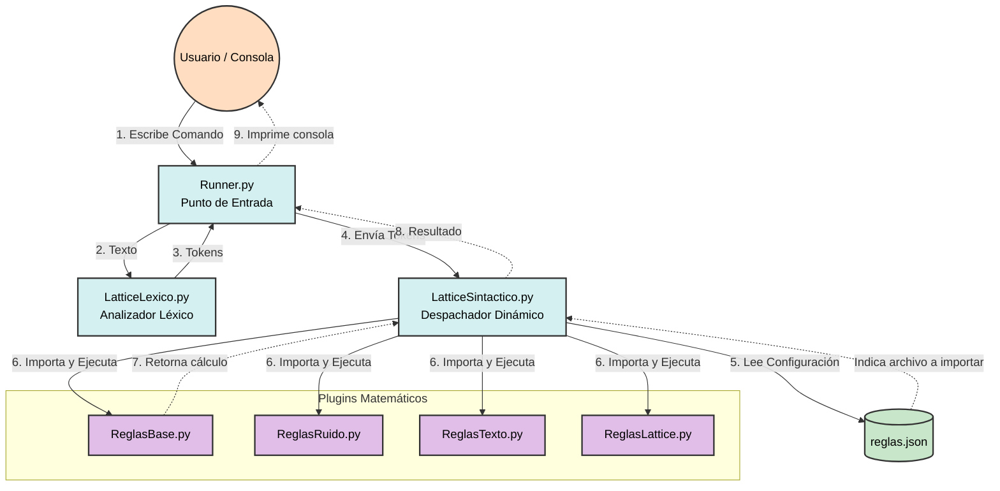

# Arquitectura del Intérprete Lattice Encrypt

Este diagrama describe la arquitectura general del proyecto, mostrando cómo se conectan los módulos principales y el despachador dinámico. Utilizando como ejemplo la operación `VECTOR(1,2) SUMA VECTOR(3,4)`.

