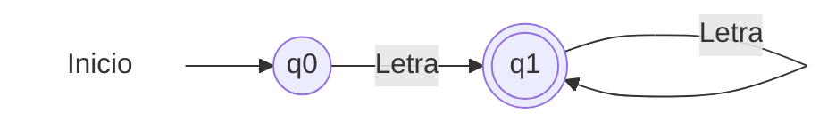

# Autómata Léxico: Palabras (Identificadores y Palabras Reservadas)

Este diagrama representa el autómata finito para reconocer palabras en el analizador léxico (`LatticeLexico.py`). 

## Componentes Básicos
*   **Estado Inicial (`q0`)**: Donde comienza el análisis cuando encuentra el primer caracter.
*   **Estado de Aceptación (`q1`)**: Representado con un doble círculo. Indica que la secuencia de caracteres leída hasta el momento forma una palabra válida.
*   **Transiciones (flechas)**: Indican qué condición se debe cumplir (leer una letra) para pasar de un estado a otro.

## Diagrama 

El estado `q1` es de aceptación. Mientras lleguen letras, el autómata se mantiene en `q1` haciendo crecer la palabra (ciclo `while i < n and texto[i].isalpha():`). Cuando llega algo que **no es una letra**, el autómata se detiene y extrae la palabra completa.
