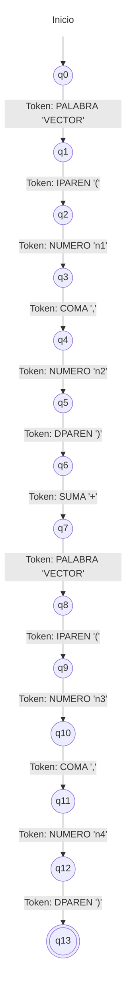

# Autómata Sintáctico: Suma de Vectores

Este diagrama representa el autómata de validación gramatical (Sintáctico) para la regla: `VECTOR(a,b) SUMA VECTOR(c,d)`. En el analizador sintáctico, las transiciones ya no son caracteres (letras o números), sino **Tokens enteros** entregados por el analizador léxico.

## Componentes Básicos
*   **Estado Inicial (`q0`)**: Estado en el que el analizador empieza a evaluar la regla gramatical.
*   **Estados Intermedios (`q1` a `q12`)**: Estados que indican que la regla se está cumpliendo parcialmente, pero aún faltan tokens (piezas de la receta) por consumir.
*   **Estado de Aceptación (`q13`)**: (Doble círculo) Significa que toda la secuencia llegó exactamente en el orden esperado y la instrucción de suma de vectores es sintácticamente válida para ejecutarse.
*   **Transiciones**: Los consumos esperados. Por ejemplo, `self.consumir("PALABRA")` o `self.consumir("IPAREN")`.

## Diagrama 

Si estando en el estado `q2` llega un token `PALABRA` en lugar de un `NUMERO`, el autómata no tiene una flecha válida por dónde avanzar y "crachea", lanzando el error (`SyntaxError: Se esperaba NUMERO y llegó PALABRA...`).
