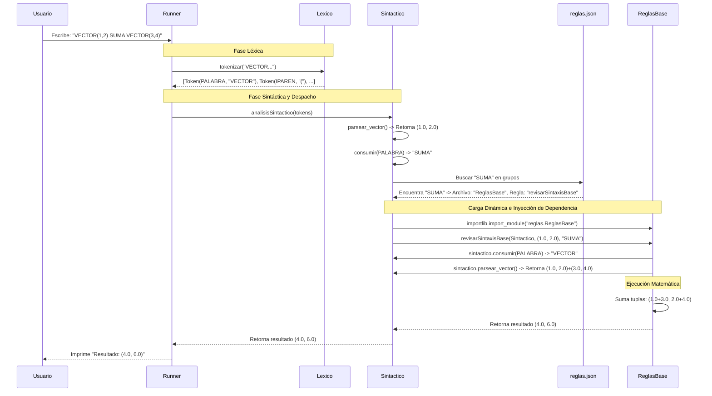

# Diagrama de Secuencia

Este diagrama muestra el flujo de ejecución paso a paso desde que el usuario ingresa un comando hasta que se imprime el resultado, utilizando como ejemplo la operación `VECTOR(1,2) SUMA VECTOR(3,4)`.

